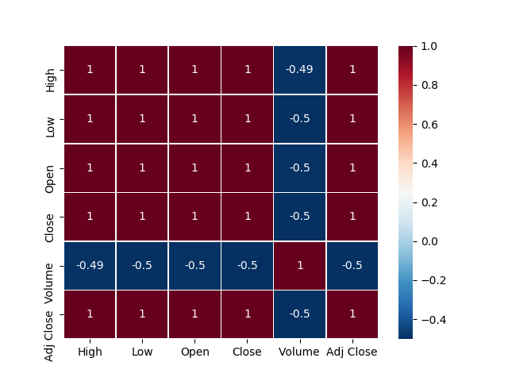
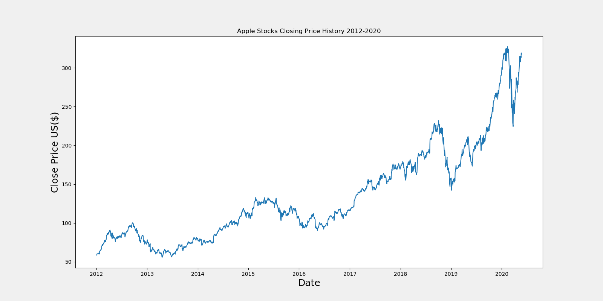
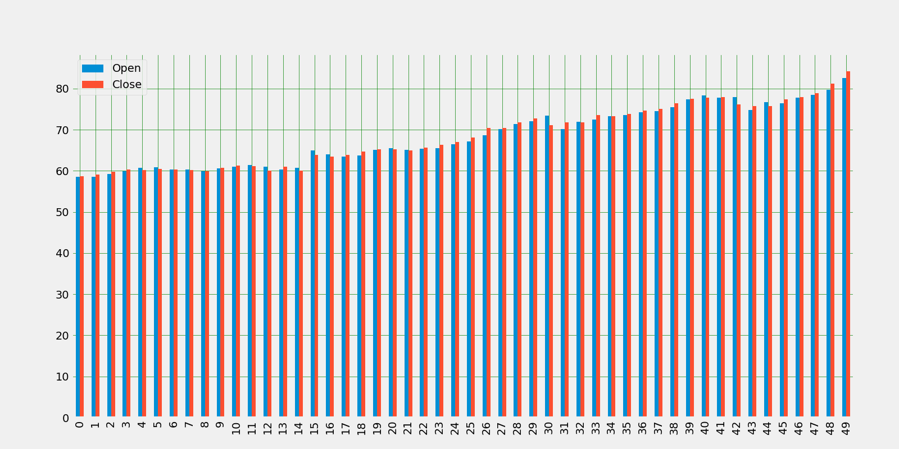
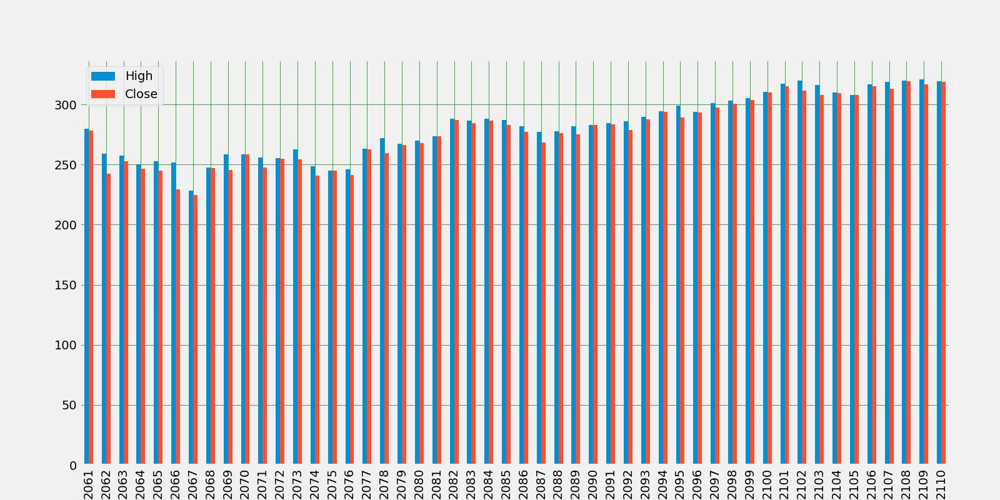
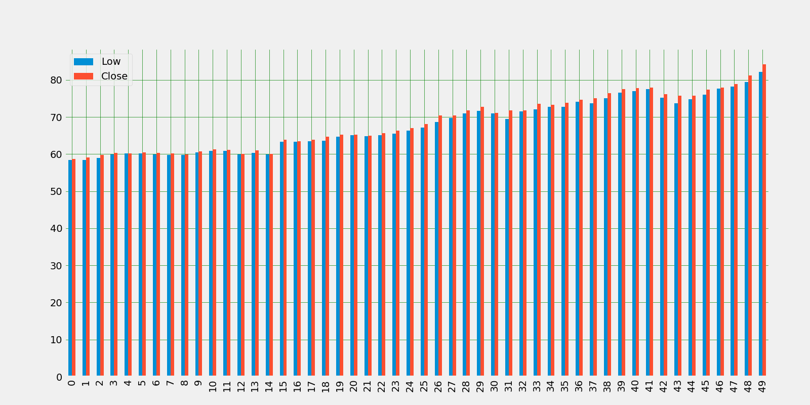
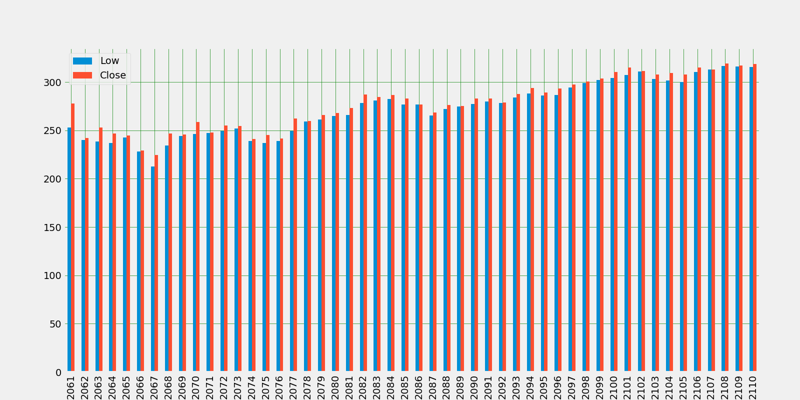
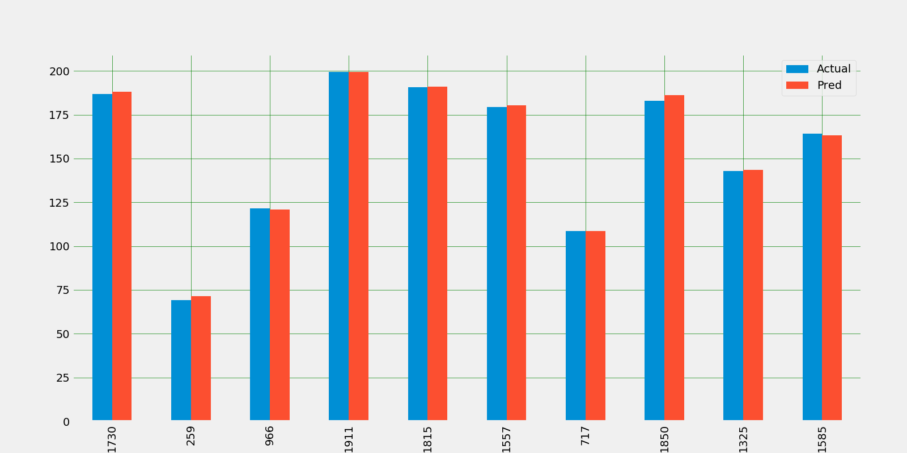

# Stock_Price_Prediction

Stock Name: AAPL (Apple)

Stock Market Basic Influencing Factor:

1. Closing Price
2. Opening Price
3. After-Hour Trading

Coding

1. Dataset Import

$pandas datareader$ library allows us to connect to the website and extract data directly from internet sources in our case we are extracting data from Yahoo Finance API.

Using following code:
$df = web.DataReader("AAPL", 'yahoo', start, end)$

Where:

$start = datetime.datetime(2012, 1, 1)$

$end = datetime.datetime(2020, 5, 22)$

2. Checking Correlation

Correlation is a measure of association or dependency between two features i.e. how much Y will vary with a variation in X. The correlation method that we will use is the Pearson Correlation.

Using Pearson Correlation coefficient:
$corr=df.corr(method='pearson')$

Pearson Correlation Coefficient is the most popular way to measure correlation, the range of values varies from -1 to 1. In mathematics/physics terms it can be understood as if two features are positively correlated then they are directly proportional and if they share negative correlation then they are inversely proportional.

### EDA (Explanatory Data Analysis)

#### Visualize the Dependent variable with independent variable

#### Bar plot of Open Price VS Close Price (Year 2012)
Let's take a look at the bar plot of top 50 data which is from 2012 year

#### Bar plot of Open Price VS Close Price (Year 2020)
Let's take a look at the bar plot of top 50 data which is from 2020 year

#### Bar plot of High Price of a day VS Close Price (Year 2012)
Let's take a look at the bar plot of top 50 data which is from 2012 year

#### Bar plot of High Price of a day VS Close Price (Year 2020)
Let's take a look at the bar plot of top 50 data which is from 2020 year

#### Bar plot of Low Price of a day VS Close Price (Year 2012)
Let's take a look at the bar plot of top 50 data which is from 2012 year

#### Bar plot of Low Price of a day VS Close Price (Year 2020)
Let's take a look at the bar plot of top 50 data which is from 2020 year

### Linear Regression Model
Linear Model Cross-Validation:

Basically Cross Validation is a technique using which Model is evaluated on the dataset on which it is not trained i.e. it can be a test data or can be another set as per availability or feasibility.

number of splits: 20

$Accuracy: 99.99726749725694$

#### Plot Actual vs Predicted Value of Linear Regression Model

### KNN: K-nearest neighbor Regression Model

k neighbors = 7

$Accuracy: 99.93212195740352$

#### Plot Actual vs Predicted Value of kNN Model

